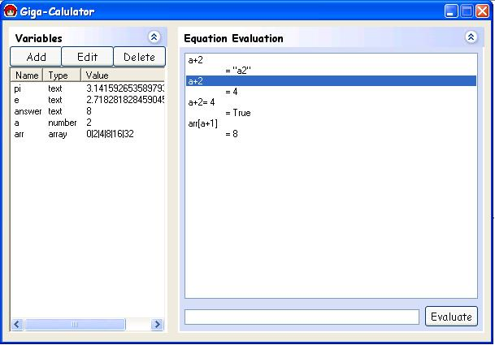



## Giga\-Calc

### Description

Similar to my Mathematical Equation Evaluator, only now with variables, and a spiffy interface.

Supports custom variable types, multi dimensional arrays, custom functions (ie: y=x+2) by using other variables in a new one
 
### More Info
 

             |
---                |---
**Submitted On**   |2003-10-12 01:03:14
**By**             |[Techni Rei Myoko](https://github.com/Planet-Source-Code/PSCIndex/blob/master/ByAuthor/techni-rei-myoko.md)
**Level**          |Advanced
**User Rating**    |4.3 (26 globes from 6 users)
**Compatibility**  |VB 6\.0
**Category**       |[Math/ Dates](https://github.com/Planet-Source-Code/PSCIndex/blob/master/ByCategory/math-dates__1-37.md)
**World**          |[Visual Basic](https://github.com/Planet-Source-Code/PSCIndex/blob/master/ByWorld/visual-basic.md)
**Archive File**   |[Giga\-Calc16573110122003\.zip](https://github.com/Planet-Source-Code/techni-rei-myoko-giga-calc__1-49104/archive/master.zip)

